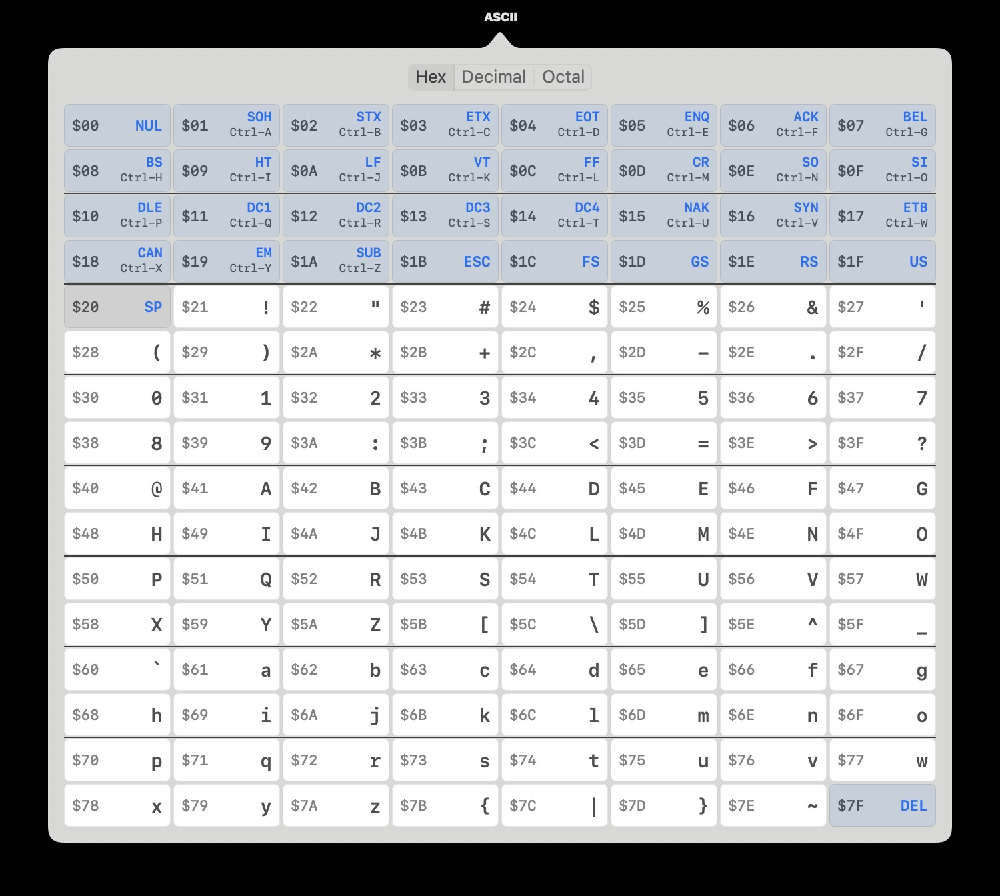

# ASCII Chart — macOS Menu Bar App



A small, always-available menu bar app that pops down a full ASCII chart.
Switch between **Hex**, **Decimal**, and **Octal** numbering with the tab
bar at the top.

- Lives in the menu bar (no Dock icon).
- Click the icon to drop down the chart, click outside to dismiss.
- 8 columns × 16 rows — the classic ASCII layout (high nibble across the
  top, low nibble down the side).
- Control characters (0x00–0x1F) and DEL (0x7F) show their standard
  abbreviations (NUL, SOH, ..., ESC, ... DEL); printable characters show
  the glyph itself.
- Hover any cell for a tooltip with all three bases plus the long name.

## Build

Requires Xcode command line tools (Swift 5.7+) on macOS 11 or newer.

```
cd ascii-chart-app
./build-app.sh
open "build/ASCII Chart.app"
```

To install permanently, drag `build/ASCII Chart.app` into `/Applications`
and (optionally) add it to your **System Settings → General → Login
Items** so it launches at login.

## Run without bundling

For quick iteration you can also just run the executable directly:

```
swift run -c release
```

(It will still appear in the menu bar; quit with Ctrl-C in the terminal.)

## Project layout

```
ascii-chart-app/
├── Package.swift
├── Info.plist
├── build-app.sh
└── Sources/AsciiChartApp/
    ├── main.swift                      # NSApplication bootstrap
    ├── AppDelegate.swift               # NSStatusItem + NSPopover
    └── AsciiChartViewController.swift  # The chart UI + base switcher
```

## About

I (@bzotto) made this with Claude Code. I can finally stop opening Terminal windows and typing `man ascii` like an idiot. Maybe you have the same problem? Enjoy!
